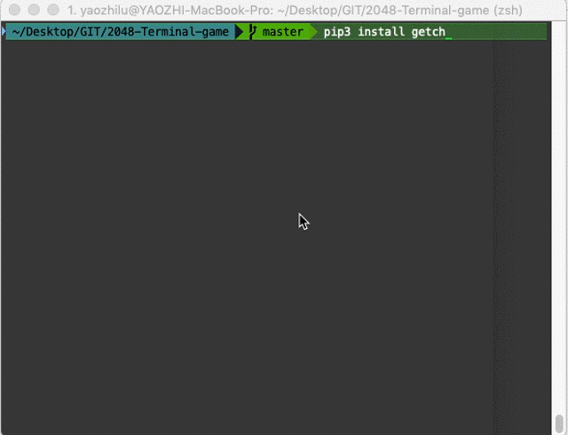

# 2048-Terminal-game
  
### Before play:  
Make sure you have getch installed. To install getch, you can run following command line:  
```pip3 install getch```  

### Play:  
  
run ```python3 2048.py``` . 
  
!!!!PLAY!!!!  
Use ```W```,```A```,```S```,```D``` to control the game.  
Use ```p``` to quit game.  
  
  
### Demo:  
  

